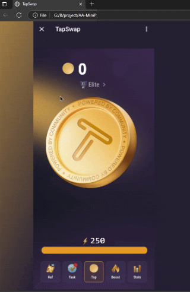

# 

<h1>📱 TapSwap - پروژه‌ای که پول نمی‌ده اما کلی حال می‌ده! 💰</h1>

## 🤔 این پروژه چیه؟
یه بازی اعتیادآور که:
- با هر کلیک یه سکه می‌گیری (البته مجازی، پول واقعی نمی‌ده!)
- باتری داری که با هر کلیک خالی می‌شه (مثل شارژ موبایل وقتی تو اینستاگرام می‌چرخیم)
- شارژ خودش کم کم پر می‌شه (مثل صبر مادرجان وقتی عصبانی‌ش می‌کنیم)

## 🎮 چطوری بازی کنیم؟
1. با موس روی دکمه وسط کلیک کن (یا اگر موبایلی، با انگشتت بزن)
2. ببین چطور سکه‌هات زیاد می‌شن (ولی نمی‌تونی با اینا پیتزا بخری!)
3. وقتی شارژ تموم شد، صبر کن تا خودش پر شه (مثل وقتی نت قطع می‌شه و باید صبر کنی)

## 💡 ویژگی‌های باحال
- **انیمیشن سکه**: هر کلیک یه انیمیشن باحال داره (انگار واقعاً پول درمیاری!)
- **ذخیره پیشرفت**: حتی اگر صفحه رو ببندی، سکه‌هات از بین نمی‌رن (برخلاف پول‌های تو جیب شلوارت که موقع شستن ناپدید می‌شن)
- **رابطه کاربری ساده**: انقدر ساده که حتی مادربزرگت هم می‌تونه بازی کنه (البته اگه بتونی براش توضیح بدی که موبایل چیه!)

## 🤯 چرا این پروژه عالیه؟
- **کد تمیز**: کدها آنقدر تمیزن که می‌تونی با اونا آیینه هم تمیز کنی!
- **ریسپانسیو**: روی موبایل و دسکتاپ خوب کار می‌کنه (مگر اینکه دستگاهت از زمان حضرت نوح باشه)
- **پروژه آموزشی**: برای شروع جاوااسکریپت عالیه (بعد از این می‌تونی بری بازی "فلابی برد" رو درست کنی!)

## 📈 آمار بی‌معنی
- ۱۰۰٪ بازیکنان بعد از ۵ دقیقه معتاد می‌شن!
- ۰٪ احتمال برد پول واقعی!
- ∞ بار کلیک کردن تا شارژ تموم شه!

## 📜 مجوز
این پروژه تحت مجوز "هرکاری دلت خواست بکن" منتشر شده. می‌تونی:
- کپی کنی
- تغییر بدی
- بفروشی‌اش (البته بعیده کسی بخره!)
- به نام خودت بزنی (ولی وجدانت اجازه می‌ده؟)

---

**نویسنده**: M'iKO
**حالت روحی موقع نوشتن**: خوشحال (به لطف کلیک‌های بی‌فایده در بازی!)  

---

پ.ن: اگه واقعاً تا اینجا خوندی، احتمالاً یا خیلی حوصله داری یا واقعاً به پروژه علاقه‌مندی. هر دو مورد خوبن! 😄
